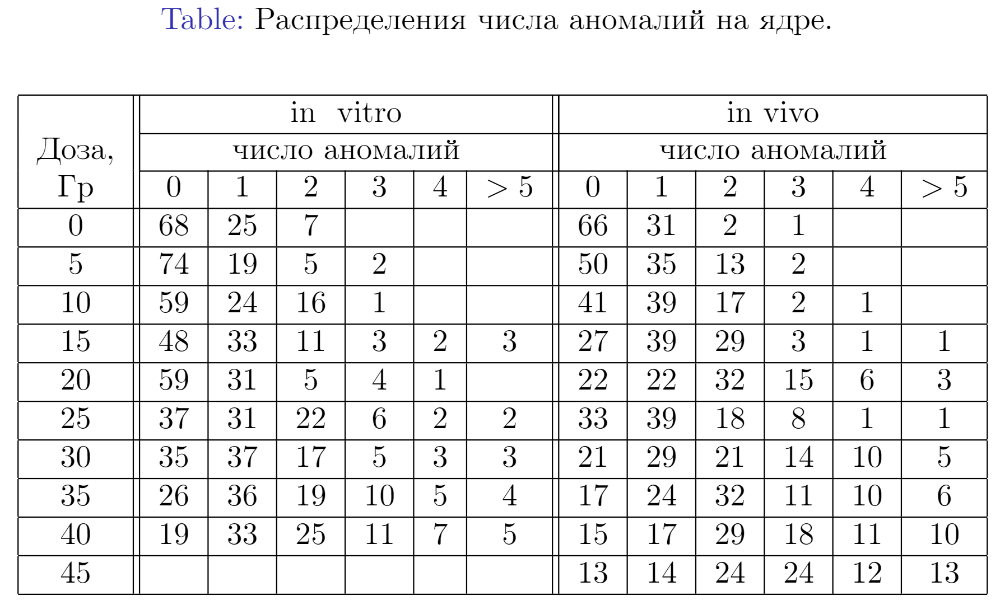

Задание: по реальным данным найти среднее, медиану, моду, дисперсию, рассеяние, ассиметрию, эксцесс.

{width="400px"}

Мой вариант: in vitro, 35 Гр.

Выполнено на языке R в R Notebook.

---

Создадим выборку по имеющимся данным.

```{r}
data <- rep(c(0,1,2,3,4,5),times=c(26,36,19,10,5,4))
data
```

Рассчитаем заданные величины.

*Среднее*:
```{r}
result.mean <- round(mean(data), 1)
print(result.mean)
```
*Медиана*:
```{r}
result.median <- round(median(data), 1)
print(result.median)
```
*Мода*:
```{r}
result.mode <- unique(data)
result.mode <- result.mode[which.max(tabulate(match(data, result.mode)))]
print(result.mode)
```
*Дисперсия*:
```{r}
result.var <- round(var(data), 1)
print(result.var)
```
*Асимметрия*:
```{r}
library(moments)
result.skewness <- round(skewness(data), 1)
print(result.skewness)
```
Ассиметрия получилась больше 0, то есть "правый хвост" распределения длиннее левого, правосторонняя асимметрия.

*Эксцесс*:
```{r}
result.kurtosis <- round(kurtosis(data), 1)
print(result.kurtosis)
```
Эксцесс получился больше 0, хвосты распределения "легче", а пик острее, чем у нормального распределения.

*Рассеяние*:
```{r}
result.scattering <- round(result.var / result.mean, 1)
print(result.scattering)
```


Сведём результаты в таблицу:
```{r}
result_df <- data.frame(result.mean, result.median, result.mode, result.var, result.skewness, result.kurtosis, result.scattering)
colnames(result_df) <- c('Среднее', 'Медиана', 'Мода', 'Дисперсия', 'Асимметрия', 'Эксцесс', 'Рассеяние')
print(result_df)
```